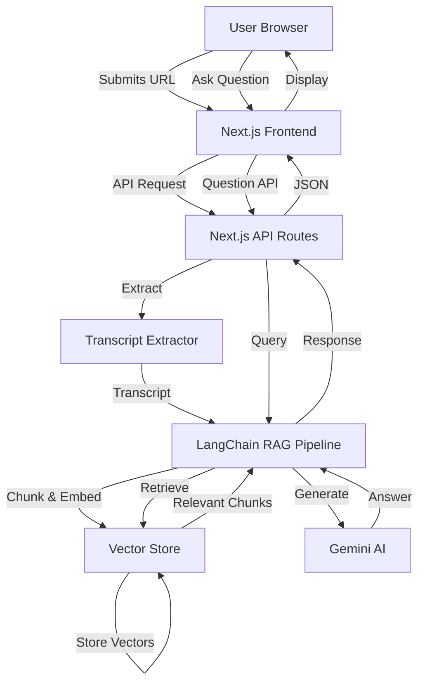

# Design Document

## Overview

The YouTube Video Q&A RAG application is a Next.js web application that enables users to interact with YouTube video content through natural language questions. The system extracts video transcripts, processes them through a RAG pipeline using LangChain, stores embeddings in a vector database, and uses Gemini AI to generate contextual answers based on retrieved content.

The application follows a client-server architecture with Next.js API routes handling backend processing, React components managing the UI, and LangChain orchestrating the RAG workflow. The design emphasizes modularity, allowing each component (transcript extraction, embedding, retrieval, generation) to operate independently while maintaining a cohesive user experience.

## Architecture

### High-Level Architecture



### Technology Stack

- **Frontend**: Next.js 14+ (App Router), React, Tailwind CSS
- **Backend**: Next.js API Routes (serverless functions)
- **AI Framework**: LangChain.js
- **Language Model**: Google Gemini AI (via @google/generative-ai)
- **Vector Store**: In-memory vector store (MemoryVectorStore) for session-based storage
- **Embeddings**: Google Generative AI Embeddings
- **Transcript Extraction**: youtube-transcript library
- **State Management**: React hooks (useState, useEffect)

### Deployment Model

The application runs as a Next.js application with:
- Static pages served from the frontend
- API routes handling backend logic
- Session-based vector storage (in-memory during user session)
- Environment variables for API keys (Gemini AI)

## Components and Interfaces

### 1. Frontend Components

#### VideoInputForm Component
```typescript
interface VideoInputFormProps {
  onSubmit: (url: string) => Promise<void>;
  isLoading: boolean;
}
```
- Renders input field for YouTube URL
- Validates URL format
- Triggers transcript extraction
- Displays loading state

#### ChatInterface Component
```typescript
interface Message {
  id: string;
  role: 'user' | 'assistant';
  content: string;
  timestamp: Date;
}

interface ChatInterfaceProps {
  messages: Message[];
  onSendMessage: (question: string) => Promise<void>;
  isProcessing: boolean;
  videoInfo?: VideoInfo;
}
```
- Displays conversation history
- Handles user question input
- Shows loading indicators
- Renders video information

#### VideoInfoCard Component
```typescript
interface VideoInfo {
  title: string;
  thumbnail: string;
  videoId: string;
}

interface VideoInfoCardProps {
  videoInfo: VideoInfo;
}
```
- Displays video thumbnail
- Shows video title
- Provides visual confirmation of loaded video

### 2. API Routes

#### POST /api/process-video
```typescript
interface ProcessVideoRequest {
  url: string;
}

interface ProcessVideoResponse {
  success: boolean;
  videoInfo: VideoInfo;
  sessionId: string;
  error?: string;
}
```
- Extracts YouTube video ID from URL
- Fetches transcript using youtube-transcript
- Chunks transcript into semantic segments
- Generates embeddings and stores in vector store
- Returns video metadata and session identifier

#### POST /api/ask-question
```typescript
interface AskQuestionRequest {
  question: string;
  sessionId: string;
}

interface AskQuestionResponse {
  answer: string;
  sources?: string[];
  error?: string;
}
```
- Receives user question and session ID
- Retrieves relevant chunks from vector store
- Constructs prompt with context
- Calls Gemini AI for answer generation
- Returns formatted response

### 3. Backend Services

#### TranscriptService
```typescript
class TranscriptService {
  async extractTranscript(videoId: string): Promise<string>;
  async getVideoInfo(videoId: string): Promise<VideoInfo>;
  parseYouTubeUrl(url: string): string | null;
}
```
- Extracts video ID from various YouTube URL formats
- Fetches transcript using youtube-transcript library
- Retrieves video metadata
- Handles errors for videos without transcripts

#### RAGService
```typescript
class RAGService {
  private vectorStore: MemoryVectorStore;
  private retriever: VectorStoreRetriever;
  
  async processTranscript(transcript: string, sessionId: string): Promise<void>;
  async answerQuestion(question: string, sessionId: string): Promise<string>;
  clearSession(sessionId: string): void;
}
```
- Manages LangChain RAG pipeline
- Splits transcripts using RecursiveCharacterTextSplitter
- Creates embeddings using GoogleGenerativeAIEmbeddings
- Stores vectors in MemoryVectorStore
- Performs semantic search via retriever
- Generates answers using Gemini AI

#### SessionManager
```typescript
class SessionManager {
  private sessions: Map<string, VectorStore>;
  
  createSession(): string;
  getSession(sessionId: string): VectorStore | null;
  deleteSession(sessionId: string): void;
}
```
- Manages user sessions and associated vector stores
- Generates unique session identifiers
- Provides session isolation for concurrent users
- Handles session cleanup

## Data Models

### Message Model
```typescript
interface Message {
  id: string;              // Unique identifier
  role: 'user' | 'assistant';  // Message sender
  content: string;         // Message text
  timestamp: Date;         // Creation time
}
```

### VideoInfo Model
```typescript
interface VideoInfo {
  videoId: string;         // YouTube video ID
  title: string;           // Video title
  thumbnail: string;       // Thumbnail URL
  duration?: number;       // Video duration in seconds
}
```

### TranscriptChunk Model
```typescript
interface TranscriptChunk {
  text: string;            // Chunk content
  metadata: {
    videoId: string;       // Source video
    startTime?: number;    // Timestamp in video
    chunkIndex: number;    // Position in transcript
  };
}
```

### RAGContext Model
```typescript
interface RAGContext {
  sessionId: string;       // Session identifier
  vectorStore: VectorStore; // Embedded chunks
  videoInfo: VideoInfo;    // Video metadata
  createdAt: Date;         // Session creation time
}
```

## Correctness Properties

*A property is a characteristic or behavior that should hold true across all valid executions of a system—essentially, a formal statement about what the system should do. Properties serve as the bridge between human-readable specifications and machine-verifiable correctness guarantees.*


### Property 1: Valid URL transcript extraction
*For any* valid YouTube video URL with available transcripts, extracting the transcript should return a non-empty string containing the video's text content.
**Validates: Requirements 1.1**

### Property 2: Invalid URL error handling
*For any* invalid YouTube URL format (malformed URLs, non-YouTube domains, invalid video IDs), the system should return an error and prevent further processing.
**Validates: Requirements 1.2**

### Property 3: Transcript chunking consistency
*For any* transcript text, splitting it into chunks should result in non-empty chunks where the concatenation of all chunks preserves the original content.
**Validates: Requirements 2.1**

### Property 4: Embedding generation completeness
*For any* set of transcript chunks, generating embeddings should produce a vector for each chunk with consistent dimensionality.
**Validates: Requirements 2.2**

### Property 5: Vector store round-trip preservation
*For any* transcript chunk stored in the vector store, retrieving it by exact match should return the original text content unchanged.
**Validates: Requirements 2.3**

### Property 6: Retriever initialization after population
*For any* populated vector store, the retriever should be able to perform semantic searches and return results.
**Validates: Requirements 2.4**

### Property 7: Session persistence
*For any* processed video session, the vector store should remain accessible and queryable throughout the session lifetime.
**Validates: Requirements 2.5**

### Property 8: Question retrieval behavior
*For any* user question and populated vector store, the retriever should return at least one relevant chunk (or empty if store is empty).
**Validates: Requirements 3.1**

### Property 9: Context inclusion in AI prompts
*For any* retrieved chunks and user question, the prompt sent to Gemini AI should include both the question text and the retrieved context.
**Validates: Requirements 3.2, 8.4**

### Property 10: Response display in chat
*For any* AI-generated response, it should be added to the message history with role 'assistant' and displayed in the chat interface.
**Validates: Requirements 3.3**

### Property 11: Message history persistence
*For any* user question or AI response, it should be added to the conversation history and remain accessible for the session.
**Validates: Requirements 4.1, 4.2**

### Property 12: Chronological message ordering
*For any* conversation history, messages should be ordered by their timestamp in ascending order (oldest first).
**Validates: Requirements 4.3**

### Property 13: Conversation reset on new video
*For any* new video loaded, the conversation history should be cleared and contain zero messages.
**Validates: Requirements 4.5, 9.3**

### Property 14: Video information display
*For any* successfully processed video, the video title and thumbnail should be displayed in the interface.
**Validates: Requirements 5.2, 9.4**

### Property 15: Loading state management
*For any* asynchronous operation (transcript extraction, embedding generation, question processing), the appropriate loading indicator should be displayed while the operation is in progress.
**Validates: Requirements 1.3, 6.1, 6.2, 6.3**

### Property 16: Processing completion state
*For any* successfully completed processing operation, the system should transition to a ready state and enable user interactions.
**Validates: Requirements 1.4, 6.5**

### Property 17: Error message display
*For any* error that occurs during processing, a descriptive error message should be displayed to the user.
**Validates: Requirements 6.4**

### Property 18: AI service error handling
*For any* Gemini AI service failure or unavailability, the system should catch the error and notify the user without crashing.
**Validates: Requirements 8.3**

### Property 19: Response formatting
*For any* raw AI response, it should be processed and formatted appropriately before being displayed to the user.
**Validates: Requirements 8.5**

### Property 20: Video processing isolation
*For any* two consecutive video processing operations, the second video's data should not contain any chunks or embeddings from the first video.
**Validates: Requirements 9.1, 9.2**

### Property 21: Input availability
*For any* application state except during active processing, the video URL input field should be enabled and accept user input.
**Validates: Requirements 9.5**

## Error Handling

### Transcript Extraction Errors
- **No transcript available**: Display user-friendly message indicating the video doesn't have captions
- **Invalid video ID**: Validate URL format before attempting extraction
- **Network errors**: Implement retry logic with exponential backoff
- **Rate limiting**: Handle YouTube API rate limits gracefully

### RAG Pipeline Errors
- **Embedding generation failure**: Log error details and notify user of processing failure
- **Vector store errors**: Validate data before storage operations
- **Empty transcript**: Handle edge case of videos with minimal or no text content
- **Chunking errors**: Ensure minimum chunk size and handle edge cases

### AI Generation Errors
- **Gemini API errors**: Catch API exceptions and provide fallback messages
- **Timeout errors**: Implement request timeouts and inform users
- **Rate limiting**: Handle API rate limits with appropriate user messaging
- **Invalid responses**: Validate AI responses before displaying

### Session Management Errors
- **Session expiration**: Implement session timeout and cleanup
- **Memory limits**: Monitor vector store size and implement limits
- **Concurrent requests**: Handle race conditions in session access

### UI Error Handling
- **Form validation**: Validate YouTube URLs before submission
- **Network errors**: Display connection error messages
- **State errors**: Implement error boundaries to catch React errors
- **Loading timeouts**: Show timeout messages for long-running operations

## Testing Strategy

### Unit Testing

The application will use **Vitest** as the testing framework for unit tests. Unit tests will focus on:

- **URL parsing and validation**: Test various YouTube URL formats (standard, shortened, embedded)
- **Transcript extraction**: Test with mock YouTube API responses
- **Text chunking**: Verify chunk sizes and overlap behavior
- **Session management**: Test session creation, retrieval, and cleanup
- **Message formatting**: Test message object creation and validation
- **Error handling**: Test error cases for each service
- **Component rendering**: Test React components with React Testing Library

Unit tests provide concrete examples and verify specific edge cases work correctly.

### Property-Based Testing

The application will use **fast-check** as the property-based testing library. Property-based tests will verify universal properties across many randomly generated inputs:

- **Minimum 100 iterations** per property test to ensure thorough coverage
- Each property test will be tagged with: `**Feature: youtube-video-qa-rag, Property {number}: {property_text}**`
- Property tests will validate the correctness properties defined above
- Generators will create realistic test data (valid/invalid URLs, transcript text, questions, etc.)

Property-based tests verify general correctness across the input space and complement unit tests by catching edge cases that might not be considered in manual test writing.

### Integration Testing

- **End-to-end RAG pipeline**: Test complete flow from URL to answer
- **API route testing**: Test Next.js API routes with mock services
- **Component integration**: Test interaction between UI components
- **Session lifecycle**: Test complete user session from start to finish

### Testing Approach

The dual testing approach ensures comprehensive coverage:
- **Unit tests** catch specific bugs and verify concrete examples
- **Property tests** verify universal correctness properties hold across all inputs
- Together they provide confidence in both specific behaviors and general correctness

## Performance Considerations

### Transcript Processing
- Implement streaming for large transcripts
- Use efficient text splitting algorithms
- Cache processed transcripts when possible

### Vector Store
- Use in-memory storage for fast retrieval
- Implement pagination for large result sets
- Consider vector store size limits per session

### API Response Times
- Set appropriate timeouts for external API calls
- Implement loading states for operations > 1 second
- Use async/await patterns for non-blocking operations

### Frontend Performance
- Implement virtual scrolling for long conversation histories
- Lazy load video thumbnails
- Debounce user input to prevent excessive API calls
- Use React.memo for expensive component renders

## Security Considerations

### API Key Management
- Store Gemini API key in environment variables
- Never expose API keys in client-side code
- Implement rate limiting to prevent abuse

### Input Validation
- Validate and sanitize all user inputs
- Prevent injection attacks in URL parsing
- Limit transcript and question length

### Session Security
- Generate cryptographically secure session IDs
- Implement session timeouts
- Clear sensitive data on session end

### Content Security
- Sanitize AI-generated responses before display
- Implement Content Security Policy headers
- Prevent XSS attacks in message rendering

## Deployment Configuration

### Environment Variables
```
GOOGLE_API_KEY=<Gemini AI API key>
NEXT_PUBLIC_APP_URL=<Application URL>
NODE_ENV=production|development
```

### Build Configuration
- Next.js production build with optimizations
- Tailwind CSS purging for minimal bundle size
- API route optimization for serverless deployment

### Hosting Recommendations
- Vercel (recommended for Next.js)
- Netlify
- AWS Amplify
- Any Node.js hosting platform

## Future Enhancements

### Potential Improvements
- Persistent vector store (PostgreSQL with pgvector, Pinecone, etc.)
- Multi-video comparison and cross-referencing
- Conversation export and sharing
- Video timestamp linking in responses
- Support for video playlists
- Multi-language transcript support
- Voice input for questions
- Conversation summarization
- Bookmark and save favorite Q&As
